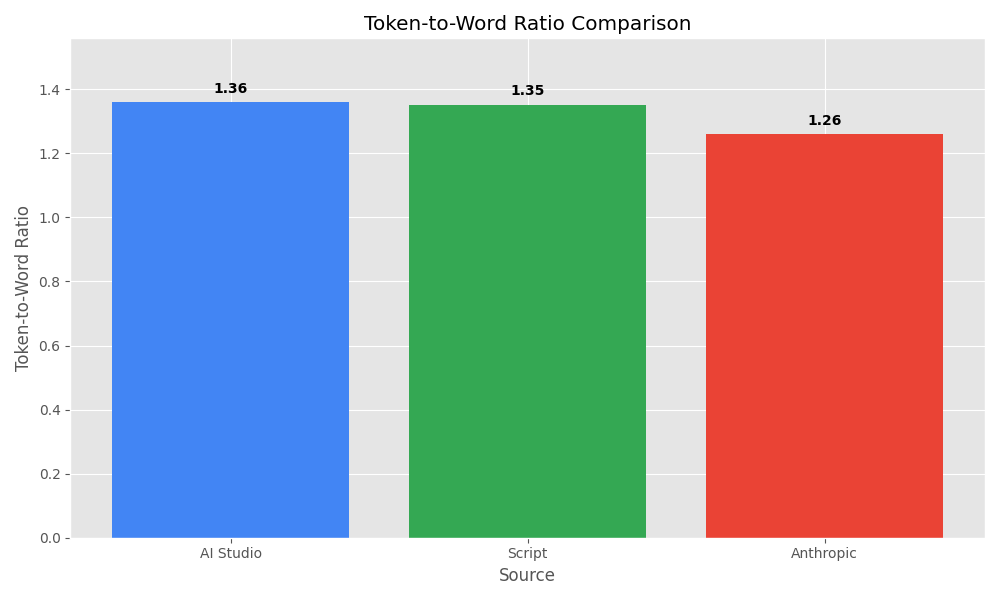

# Can Gemini 2.5 Write A Book In One Prompt?

(Spoiler alert: not yet. But Anthropic can!)

April 09, 2025

The pace of development in AI these days is so fast that it's hard to keep on top of all the latest developments.

I've always found it interesting that among all the hotly debated parameters discussed in the most recent SOTA models, the question of how many tokens a model can generate in one continuous output (max output tokmens) seems to be very little discussed. 

This metric exists independent of the maximum input tokens and the context window.

To date, even models with huge context windows have had curiously limited maximum output tokens.

For most ordinary use cases, even a limit of 8192 tokens like Gemini 2.0 doesn't pose much of a constraint. When you begin using AI tools for code generation, however, it's surprisingly easy to exceed that context. Which leaves chunking approaches as the default. Go to for when you need to produce a continuous output and maintain a consistent formatting. 

## Can Gemini 2.5 Really Do 65K Tokens?

When Google launched Gemini 2.5, relatively scant attention was paid to the fact that the model brought a huge step forward in Max output tokens from 2.0's'of 8192 to 2.5's theoretical limit of 65,536, representing a four fold increase. 

 

 

 After noticing this in the Google AI Studio UI, my mind was  quickly  drawn towards one question: How many words can fit in that? Is that like an entire book? And if so, can I try to write a book using one single prompt!?

 ## 65K Tokens In Book Terms: Frankenstien, Price And Predjudice, Sherlock Holmes!

 | Description                | Value       |
|----------------------------|-------------|
| Tokens                     | 65,000      |
| Approximate Words          | 48,750      |
| A4 Pages (double spaced)   | 195         |
| Paperback Book Pages       | 139         |

For further context, here are some real books that have approximately that word count. 

| Title                             | Author                    | Approximate Word Count | Estimated Page Count |
|-----------------------------------|--------------------------|------------------------|----------------------|
| The Adventures of Sherlock Holmes  | Arthur Conan Doyle       | 43,000 - 50,000        | ~139                 |
| The Picture of Dorian Gray        | Oscar Wilde              | ~78,000                | ~139                 |
| Pride and Prejudice               | Jane Austen              | ~120,000               | ~139                 |
| Frankenstein                      | Mary Shelley             | ~78,000                | ~139                 |

## My Book Experiment
 
 To try this out, I needed to write a prompt which would request the generation of a book which is in the prompt file.  With the exception of some obviously fictitious elements, the plot is based on my own life story, but intentionally a bit ridiculous.

## Actual Output Results

The system prompt specified 38-40,000 words, but the actual outputs were significantly less than the claimed maximum token output (65,536 tokens). Here are the actual results calculated using our analysis scripts:

### Word Count Analysis

This estimate is based on the theoretical assumed word count for the tokenization. 

| Output Source | Word Count | Character Count | Percentage of Claimed Maximum,  Approximating  (48,750 words) |
|---------------|------------|-----------------|----------------------------------------------|
| AI Studio     | 11,517     | 74,486          | 23.62%                                       |
| Script        | 10,516     | 66,567          | 21.57%                                       |
| Anthropic     | 27,655     | 182,182         | 56.73%                                       |

### Token Count Analysis

| Output Source | Token Count | Token-to-Word Ratio | Percentage of Max Tokens (65,536) |
|---------------|-------------|---------------------|-----------------------------------|
| AI Studio     | 15,651      | 1.36                | 23.88%                            |
| Script        | 14,211      | 1.35                | 21.68%                            |
| Anthropic     | 34,836      | 1.26                | 53.16%                            |

### Token-to-Word Ratio Comparison

### Book Comparison

Comparing the outputs with classic books:

| Book/Output | Word Count | Percentage of Max Output (48,750 words) |
|-------------|------------|---------------------------------------|
| Sherlock Holmes | 46,500 | 95.38% |
| Dorian Gray | 78,000 | 160.00% |
| Pride & Prejudice | 120,000 | 246.15% |
| Frankenstein | 78,000 | 160.00% |
| AI Studio Output | 11,517 | 23.62% |
| Script Output | 10,516 | 21.57% |
| Anthropic Output | 27,655 | 56.73% |

## Comparison Between Methods

The script output produced 1,440 fewer tokens than the AI Studio output, a difference of 9.20%.
The Anthropic output produced 19,185 more tokens than the AI Studio output, a difference of +122.58%.
The Anthropic output produced 20,625 more tokens than the Script output, a difference of +145.13%.

## Key Findings

1. **Actual Output vs. Claimed Maximum**: Both Gemini methods produced outputs that were only about 1/4 of the claimed maximum capacity, while Anthropic produced output that was just over half (53.16%) of the claimed maximum.
2. **Token-to-Word Ratio**: The average ratio ranged from 1.26 to 1.36 tokens per word across the methods, with Anthropic having the lowest ratio.
3. **Book Equivalent**: The Gemini outputs represent approximately 1/4 of a typical novel in length, while the Anthropic output represents over half of a typical novel.